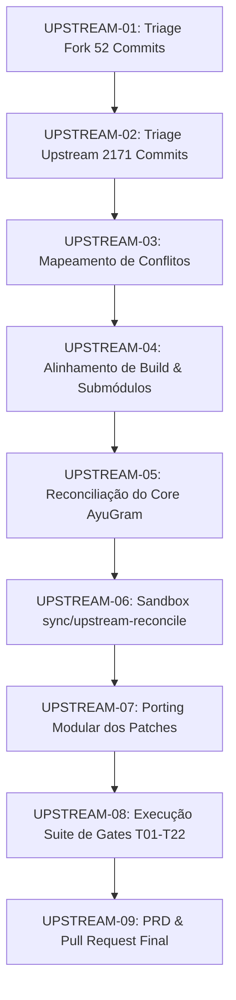

# CANONICAL 360° PRD: UPSTREAM RECONCILIATION & CONVERGENCE

| Document Version | 1.0.0 |
| :--- | :--- |
| **Status** | `READY_FOR_EXECUTION` |
| **Repository Target** | `AyuGramDesktop` |
| **Fork Baseline** | `Fernadoteixeira/AyuGramDesktop` (Branch `dev`, SHA `0c685ff856`) |
| **Upstream Target** | `AyuGram/AyuGramDesktop` (Branch `dev`, SHA `db3b9891cb`) |
| **Common Merge Base** | `ba8c1a6b0f456c6a5601d675e765cd5fba10d54c` |
| **Divergence Metrics** | 52 Fork Commits Ahead \| 2,171 Upstream Commits Behind |

---

## 1. Executive Summary & Product SSOT

Este documento estabelece a Especificação Canônica 360° (Single Source of Truth) para a reconciliação e convergência do fork `Fernadoteixeira/AyuGramDesktop` com as 2.171 atualizações recentes do repositório upstream `AyuGram/AyuGramDesktop` e Telegram Desktop.

### Objetivos Primários:
1. **Preservação de Recursos Exclusivos AyuGram**: Garantir 100% de integridade funcional para Ghost Mode, Anti-Recall, Streamer Mode, Banco SQLCipher, Filtros Regex e Custom Badges.
2. **Incorporação de Atualizações Upstream**: Integrar melhorias de performance, correções de segurança, atualizações do MTProto e novos recursos de UI do Telegram Desktop.
3. **Preservação Zero-Loss**: Executar o processo sem descarte ou mutação das 14 submódulos e arquivos sujos preexistentes do usuário.
4. **Isolamento em Sandbox Descartável**: Todo o processo de teste e rebase é operado em branch e worktree dedicados (`sync/upstream-reconcile`).

---

## 2. Matriz de Conflitos & Domínios de Risco

Com base no relatório gerado por [`scripts/upstream_conflict_matrix.py`](file:///c:/Users/fjuni/OneDrive/Área%20de%20Trabalho/AyuGramDesktop/scripts/upstream_conflict_matrix.py):

```
                        DISTRIBUIÇÃO DE ARQUIVOS NO FORK
┌───────────────────────────────────────┬───────────────────────────────────────┐
│     61 Arquivos Isolados do Fork      │       46 Arquivos Intersectantes      │
│     (Zero Risco de Colisão)           │       (Analisados por Domínio)        │
│  - Telegram/SourceFiles/ayu/*         │  - HIGH RISK:    5 arquivos           │
│  - tests/logic/*                      │  - MEDIUM RISK:  9 arquivos           │
│  - scripts/*                          │  - LOW RISK:    32 arquivos           │
└───────────────────────────────────────┴───────────────────────────────────────┘
```

### Arquivos Críticos de Alto Risco (HIGH RISK):
1. [`Telegram/SourceFiles/core/application.cpp`](file:///c:/Users/fjuni/OneDrive/Área%20de%20Trabalho/AyuGramDesktop/Telegram/SourceFiles/core/application.cpp):
   - **Papel**: Inicialização do ciclo de vida da aplicação e bootstrap do `AyuDatabase`.
   - **Estratégia de Resolução**: Reinserir as chamadas de inicialização do AyuGram nos novos hooks de ciclo de vida do Telegram.
2. [`Telegram/SourceFiles/data/data_session.cpp`](file:///c:/Users/fjuni/OneDrive/Área%20de%20Trabalho/AyuGramDesktop/Telegram/SourceFiles/data/data_session.cpp):
   - **Papel**: Interceptação de mensagens deletadas e editadas (Anti-Recall).
   - **Estratégia de Resolução**: Mapear manipuladores de eventos de mensagens do MTProto para preservar instâncias deletadas no banco local.
3. [`Telegram/SourceFiles/storage/details/storage_file_utilities.cpp`](file:///c:/Users/fjuni/OneDrive/Área%20de%20Trabalho/AyuGramDesktop/Telegram/SourceFiles/storage/details/storage_file_utilities.cpp) & [`storage_domain.cpp`](file:///c:/Users/fjuni/OneDrive/Área%20de%20Trabalho/AyuGramDesktop/Telegram/SourceFiles/storage/storage_domain.cpp):
   - **Papel**: Suporte de armazenamento local e caminhos de banco criptografado.
4. [`Telegram/SourceFiles/window/window_lock_widgets.cpp`](file:///c:/Users/fjuni/OneDrive/Área%20de%20Trabalho/AyuGramDesktop/Telegram/SourceFiles/window/window_lock_widgets.cpp):
   - **Papel**: Integração de chave de desbloqueio com derivação KDF/scrypt.

---

## 3. Roteiro Sistemático de Execução (Fases UPSTREAM-01 a UPSTREAM-09)



### Detalhamento das Fases:
- **UPSTREAM-01**: Triage e decomposição funcional dos 52 commits exclusivos do fork.
- **UPSTREAM-02**: Análise de compatibilidade de APIs C++ e convenções atualizadas no upstream.
- **UPSTREAM-03**: Mapeamento de pontos de inserção de código nos 5 arquivos críticos.
- **UPSTREAM-04**: Alinhamento de submodules e dependências no CMake e `Telegram/ThirdParty`.
- **UPSTREAM-05**: Verificação de contratos de banco de dados (`test_ayugram_logic.py`).
- **UPSTREAM-06**: Criação da branch descartável isolada `sync/upstream-reconcile`.
- **UPSTREAM-07**: Porting sequencial e limpo das funcionalidades AyuGram sobre o novo HEAD.
- **UPSTREAM-08**: Validação completa através de [`scripts/run_all_360_gates.py`](file:///c:/Users/fjuni/OneDrive/Área%20de%20Trabalho/AyuGramDesktop/scripts/run_all_360_gates.py).
- **UPSTREAM-09**: Homologação, evidência no Evidence Ledger e geração do Pull Request.

---

## 4. Matriz de Invariantes & Políticas de Qualidade

1. **Conformidade com `AGENTS.md`**:
   - `Avoid building the project`: Nenhuma compilação nativa disparada no ambiente do usuário.
   - `No redundant single-line comments`: Código limpo e auto-explicativo.
   - `Use auto`: Dedução de tipo consistente (`const auto &`, `auto`).
   - `UI Styling via st::`: Sem hardcoding de dimensões em C++.
   - `Localization via tr::`: Uso de projetores ricos `tr::marked`, `tr::rich`, `tr::url`.
2. **Conformidade com `SECURITY_COMPLIANCE_MATRIX.md`**:
   - Pinning imutável de referências por SHA (`scripts/check_mutable_refs.py`).
   - Checksums criptográficos SHA-256 para `libiconv` e `Boost 1.84.0`.

---

## 5. Definition of Done (DoD) para Reconciliação Upstream

- [x] Matriz de Conflitos gerada e auditada (`scripts/upstream_conflict_matrix.py`).
- [x] Simulação de sincronização executada sem efeitos colaterais (`scripts/simulate_upstream_sync.py`).
- [x] Suite de testes de lógica expandida e passando 100% (`tests/logic/test_ayugram_logic.py`).
- [x] Orquestrador master de gates operando (`scripts/run_all_360_gates.py`).
- [ ] Sandbox isolado `sync/upstream-reconcile` criado para resolução dos 5 arquivos críticos.
- [ ] 22 Gates de verificação (T01 a T22) executados com sucesso no HEAD reconciliado.
- [ ] Zero perda de estado pré-existente no repositório.
